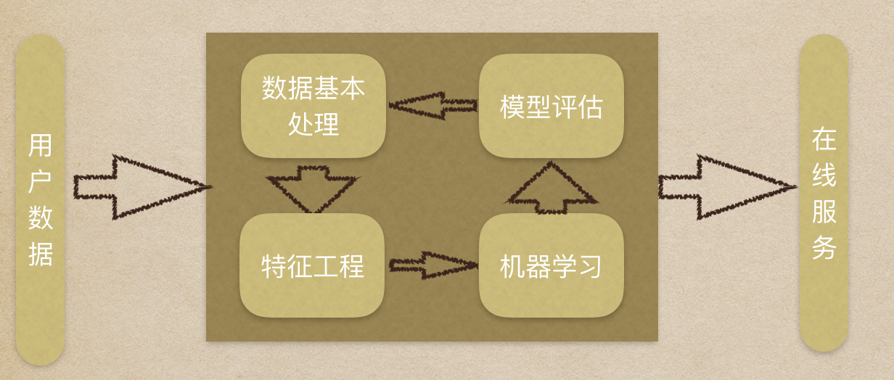

# 2.1 机器学习工作流程

## 2.1.1 机器学习工作流程

### 1. 获取数据
首先需求来了后，要获取对应的数据，这个数据可能是项目里的，也可能是从第三方获取的，拿到数据后才能做下一步工作。

### 2. 数据处理
数据很整齐的情况比较少见，大部分情况我们需要把数据处理一下，把一些异常数据，不规则数据过滤/修改。

### 3. 特征工程
有整齐的数据后，需要抽取数据的特征，把比较有影响力的数据抽取出来做加工转化，从而让机器更好的学习。

自学和有好老师教还是不一样的，老师会把知识根据自己的经验进行抽取总结，再让你学习会更高效，因为学到的都是重点，数据太多全部都学会适得其反，特征工程就是取其精华去其糟粕。

### 4. 模型训练

选取适合的算法，拿特征数据训练，输出模型

### 5. 模型评估

一般训练模型我们会进行数据划分，按照8:2划分，80%作为训练，20%作为验证准确率

模型训练出来后，我们要对他进行评估、测试。

评估测试有以下几种方案：
1. 交叉验证，输出指标对比。
2. 线下测试，指标一般跟具体的业务需求相关，包括：准确率(accuracy)、精确率(precesion)、召回率(recall)、F1值等。
3. 线上测试，模型上线后测试，根据用户反馈，和之前的模型对比，从而判断好坏。

## 2.1.2 专有名词介绍

### 1. 样本
指一条数据
### 2. 数据集
一组样本的集合
### 3. 目标值
目标值是我们所要判断或预测的一些属性
### 4. 特征值
可以反映出一些目标值的主要特点，例如：我们要判断一个人的性别，则特征值为身高、体重、长发短发等
