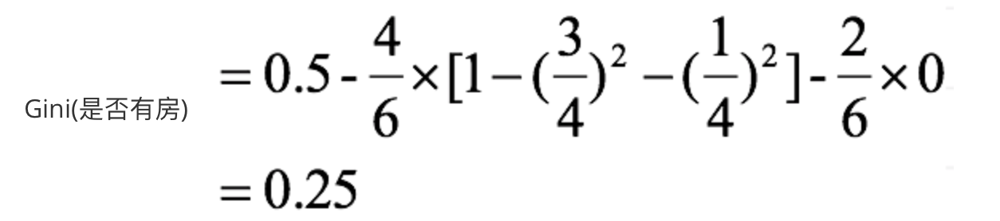

# 3.2 决策树算法

## 3.2.1 决策树概念
决策树思想的来源非常朴素，程序设计中的条件分支结构就是if-else结构，最早的决策树就是利用这类结构分割数据的一种分类学习方法

决策树：是一种树形结构，其中每个内部节点表示一个属性上的判断，每个分支代表一个判断结果的输出，最后每个叶节点代表一种分类结果，本质是一颗由多个判断节点组成的树。

怎么理解这句话？通过一个对话例子

想一想这个女生为什么把年龄放在最上面判断！

上面案例是女生通过定性的主观意识，把年龄放到最上面，那么如果需要对这一过程进行量化，该如何处理呢？

此时需要用到信息论中的知识：信息熵，信息增益

## 3.2.2 决策树分类原理

### 1. 熵概念
物理学上，熵 Entropy 是“混乱”程度的量度。

系统越有序，熵值越低；系统越混乱或者分散，熵值越高。

1. 从信息完整性描述

当系统的有序状态一致时，数据越集中的地方熵值越小，数据越分散的地方熵值越大。

2. 从信息有序性描述

当数据量一致时，系统越有序，熵值越低；系统越混乱或者分散，熵值越高。

假如事件A的分类划分是（A1,A2,...,An），每部分发生的概率是(p1,p2,...,pn)，那信息熵定义为公式如下：（log是以2为底）

### 2. 熵案例介绍

1. 如果一颗骰子的六个面都是1 ，投掷它不会给你带来任何新信息，因为你知道它的结果肯定是1，它的信息熵为？

答案：log(1) = 0

2. 假设我们没有看世界杯的比赛，但是想知道哪支球队会是冠军，我们只能猜测某支球队是或不是冠军，然后观众用对或不对来回答，我们想要猜测次数尽可能少，你会用什么方法？

答案：二分法  
计算过程：  
假如有 16 支球队，分别编号，先问是否在 1-8 之间，如果是就继续问是否在 1-4 之间，  
以此类推，直到最后判断出冠军球队是哪只。  
如果球队数量是 16，我们需要问 4 次来得到最后的答案。那么世界冠军这条消息的信息熵就是 4。

如果有32个球队，准确的信息量应该是：   
H = -（p1 * logp1 + p2 * logp2 + ... + p32 * logp32），  
其中 p1, ..., p32 分别是这 32 支球队夺冠的概率。  
当每支球队夺冠概率相等都是 1/32 的时：H = -（32 * 1/32 * log1/32） = 5  
每个事件概率相同时，熵最大，这件事越不确定。

### 3. 信息增益概念
以某特征划分数据集前后的熵的差值。熵可以表示样本集合的不确定性，熵越大，样本的不确定性就越大。因此可以使用划分前后集合熵的差值来衡量使用当前特征对于样本集合D划分效果的好坏。

特征A对训练数据集D的信息增益g(D,A),定义为集合D的信息熵H(D)与特征A给定条件下D的信息条件熵H(D|A)之差，即公式为：

### 3. 信息增益案例
如下左图，第一列为论坛号码，第二列为性别，第三列为活跃度，最后一列用户是否流失。

我们要解决一个问题：性别和活跃度两个特征，哪个对用户流失影响更大？

通过计算信息增益可以解决这个问题，统计上右表信息

其中Positive为正样本（已流失），Negative为负样本（未流失），下面的数值为不同划分下对应的人数。

可得到三个熵：

整体熵：

性别熵：

活跃度熵：

计算信息增益看指标影响：

性别信息增益：

活跃度信息增益：

活跃度的信息增益比性别的信息增益大，也就是说，活跃度对用户流失的影响比性别大。

在做特征选择或者数据分析的时候，我们应该重点考察活跃度这个指标。

### 4. 信息增益率
增益率：增益比率度量是用前面的增益度量Gain(S，A)和所分离信息度量SplitInformation(如上例的性别，活跃度等)的比值来共同定义的。

### 5. 基尼值和基尼指数
基尼值Gini（D）：从数据集D中随机抽取两个样本，其类别标记不一致的概率。故，Gini（D）值越小，数据集D的纯度越高。

基尼指数Gini_index（D）：一般，选择使划分后基尼系数最小的属性作为最优化分属性。

### 6. 基尼指数案例

1. 对数据集非类标号属性 {是否有房，婚姻状况，年收入} 分别计算它们的Gini系数增益，取Gini系数增益值最大的属性作为决策树的根节点属性。
2. 根节点的Gini系数为：

3. 当根据是否有房来进行划分时，Gini系数增益计算过程为：

**由此可见，有房的人拖欠贷款概率小**

4. 若按婚姻状况属性来划分，属性婚姻状况有三个可能的取值{married，single，divorced}，分别计算划分后的Gini系数增益。

​ {married} | {single,divorced}

​ {single} | {married,divorced}

​ {divorced} | {single,married}

分组为{married} | {single,divorced}时：

当分组为{single} | {married,divorced}时：

当分组为{divorced} | {single,married}时：

对比计算结果，根据婚姻状况属性来划分根节点时取Gini系数增益最大的分组作为划分结果，即:{married} | {single,divorced}

5. 同理可得年收入Gini：
对于年收入属性为数值型属性，首先需要对数据按升序排序，然后从小到大依次用相邻值的中间值作为分隔将样本划分为两组。例如当面对年收入为60和70这两个值时，我们算得其中间值为65。以中间值65作为分割点求出Gini系数增益。

最大化增益等价于最小化子女结点的不纯性度量（Gini系数）的加权平均值，现在我们希望最大化Gini系数的增益。根据计算知道，三个属性划分根节点的增益最大的有两个：年收入属性和婚姻状况，他们的增益都为0.12。此时，选取婚姻状况的属性作为第一次划分。

6. 采用同样的方法，分别计算剩下属性，其中根节点的Gini系数为（此时是否拖欠贷款的各有3个records）

7. 对于是否有房属性，可得：

8. 对于年收入属性则有：

最终决策树诞生，此时有新的数据来，我们可以直接按照这棵决策树的判断条件进行预测。

基尼值越纯的节点，越容易决策出结果。

本章一开始的举例，把年龄放到最上面，是因为年龄这个属性，大概率决定了决策方向，如果太大直接结束。

## 3.2.3 决策树构建总结

### 1. 构建决策树步骤
1. 开始将所有记录看作一个节点
2. 遍历每个变量的每一种分割方式，找到最好的分割点
3. 分割成两个节点N1和N2
4. 对N1和N2分别继续执行2-3步，直到每个节点足够“纯”为止。

### 2. 决策树变量

1. 数字型（Numeric）：变量类型是整数或浮点数，如前面例子中的“年收入”。用“>=”，“>”,“<”或“<=”作为分割条件（排序后，利用已有的分割情况，可以优化分割算法的时间复杂度）。

2. 名称型（Nominal）：类似编程语言中的枚举类型，变量只能从有限的选项中选取，比如前面例子中的“婚姻情况”，只能是“单身”，“已婚”或“离婚”，使用“=”来分割。

### 3. 评估分割点的好坏
如果一个分割点可以将当前的所有节点分为两类，使得每一类都很“纯”，也就是同一类的记录较多，那么就是一个好分割点。

​ 比如上面的例子，“拥有房产”，可以将记录分成了两类，“是”的节点全部都可以偿还债务，非常“纯”；“否”的节点，可以偿还贷款和无法偿还贷款的人都有，不是很“纯”，但是两个节点加起来的纯度之和与原始节点的纯度之差最大，所以按照这种方法分割。构建决策树采用贪心算法，只考虑当前纯度差最大的情况作为分割点。

## 3.2.4 常见决策树类型比较

### 1. ID3 算法
存在的缺点

1. ID3算法在选择根节点和各内部节点中的分支属性时，采用信息增益作为评价标准。信息增益的缺点是倾向于选择取值较多的属性，在有些情况下这类属性可能不会提供太多有价值的信息。
2. ID3算法只能对描述属性为离散型属性的数据集构造决策树。

### 2. C4.5算法
#### 1. 做出的改进(为什么使用C4.5要好)

1. 用信息增益率来选择属性
2. 可以处理连续数值型属性
3. 采用了一种后剪枝方法
4. 对于缺失值的处理

#### 2. C4.5算法的优缺点

优点：

产生的分类规则易于理解，准确率较高。

缺点：

在构造树的过程中，需要对数据集进行多次的顺序扫描和排序，因而导致算法的低效。
此外，C4.5只适合于能够驻留于内存的数据集，当训练集大得无法在内存容纳时程序无法运行。

### 3. CART算法
CART算法相比C4.5算法的分类方法，采用了简化的二叉树模型，同时特征选择采用了近似的基尼系数来简化计算。

C4.5不一定是二叉树，但CART一定是二叉树。

同时，无论是ID3, C4.5还是CART,在做特征选择的时候都是选择最优的一个特征来做分类决策，但是大多数，分类决策不应该是由某一个特征决定的，而是应该由一组特征决定的。这样决策得到的决策树更加准确。这个决策树叫做多变量决策树(multi-variate decision tree)。在选择最优特征的时候，多变量决策树不是选择某一个最优特征，而是选择最优的一个特征线性组合来做决策。这个算法的代表是OC1，这里不多介绍。

如果样本发生一点点的改动，就会导致树结构的剧烈改变。这个可以通过随机森林之类的方法解决。

掌握了信息熵、信息增益、信息增益率、基尼系数、基尼系数增益的计算方法，接下来就可以开始构造决策树了。

## 3.2.5 cart剪枝

### 1. 为什么要剪枝

- 横轴表示在决策树创建过程中树的结点总数，纵轴表示决策树的预测精度。
- 实线显示的是决策树在训练集上的精度，虚线显示的则是在一个独立的测试集上测量出来的精度。
- 随着树的增长，在训练样集上的精度是单调上升的， 然而在独立的测试样例上测出的精度先上升后下降。

#### 出现这种情况的原因：

1. 噪声、样本冲突，即错误的样本数据。
2. 特征即属性不能完全作为分类标准。
3. 巧合的规律性，数据量不够大。

### 2. 常用的减枝方法

#### 1. 预剪枝
1. 每一个结点所包含的最小样本数目，例如10，则该结点总样本数小于10时，则不再分；
2. 指定树的高度或者深度，例如树的最大深度为4；
3. 指定结点的熵小于某个值，不再划分。随着树的增长，在训练样集上的精度是单调上升的，然而在独立的测试样例上测出的精度先上升后下降。

#### 2. 后剪枝：
在已生成`过拟合`决策树上进行剪枝，可以得到简化版的剪枝决策树。

## 2.2.6 决策树算法API
