# 3.1 K-近邻算法介绍
K Nearest Neighbor算法又叫KNN算法，这个算法是机器学习里面一个比较经典且容易理解的分类算法。

1968年由 Cover 和 Hart 提出，应用场景有字符识别、文本分类、图像识别等领域。

该算法的思想是：一个样本与数据集中的k个样本最相似，如果这k个样本中的大多数属于某一个类别.

TODO：待补充，交叉验证、网格搜索代码示例

## 3.1.1 KNN概念

- Knn定义

单/多维空间中，在一个样本的位置周围，获取k个样本，统计k个样本大部分所属类别，那这个样本也属于这个类别。
- 距离公式

获取两个样本的距离可以通过以下公式计算，又叫欧式距离。对于高维特征，曼哈顿距离（即p更低）更能避免维度灾难的影响，效果更优。欧几里得距离（次数更高）更能关注大差异较大的特征的情况

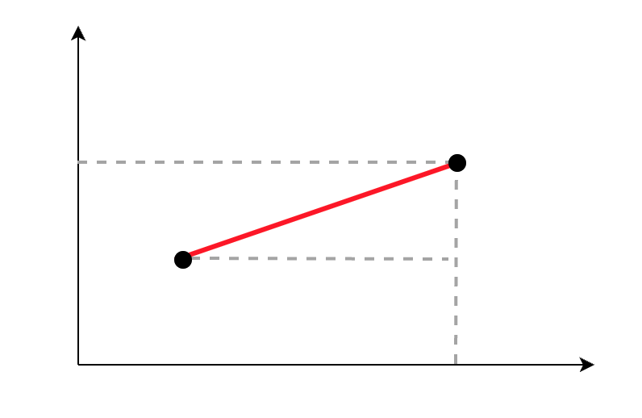
在二维空间下，计算两点之间距离，做辅助线，形成直角三角形，用公式计算斜边长度。

三维我目前不会画，直接上计算公式吧

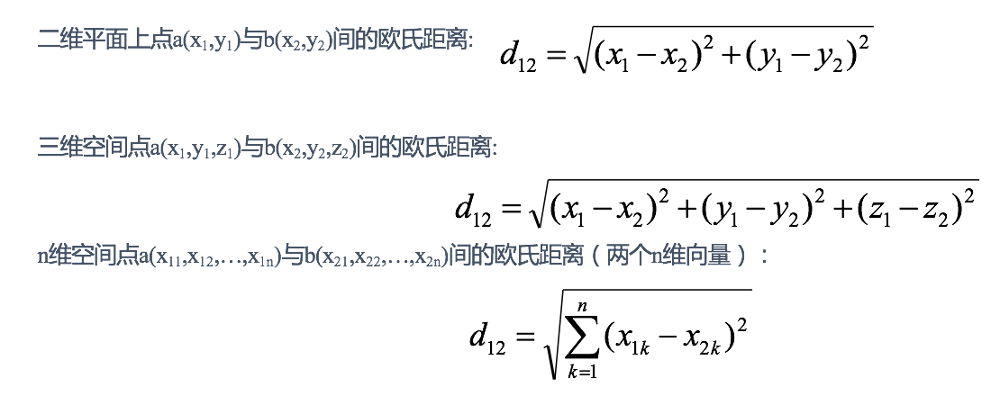

## 3.1.2 电影类型分析

我们现在有一组电影数据

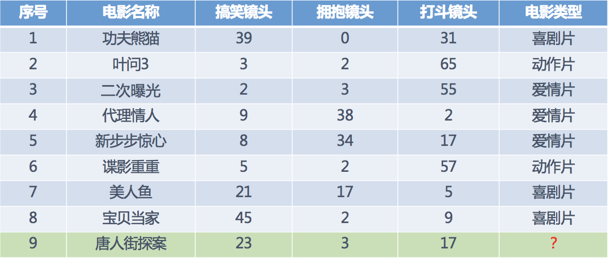

我们对ID为9的数据进行预测电影类型，可以使用K近邻的思想

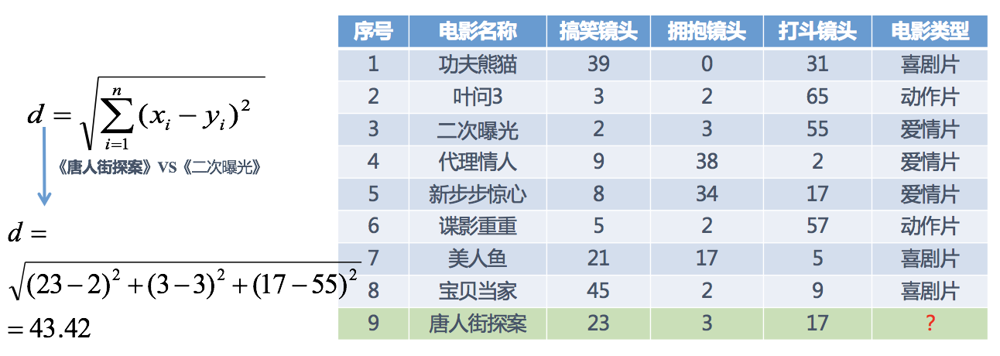

分别计算每个电影与ID为9的距离，然后求解

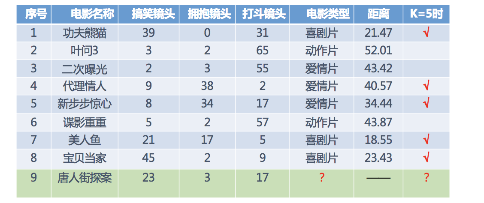

取最近五个值的时候，喜剧片3、爱情片2，喜剧片较多，所以预测ID为9的电影是喜剧片


## 3.1.3 K近邻算法API
### 1. 构建参数介绍
```py
sklearn.neighbors.KNeighborsClassifier(n_neighbors=5,algorithm='auto')
```
- n_neighbors：int,可选（默认= 5），k_neighbors查询默认使用的邻居数
- algorithm：{‘auto’，‘ball_tree’，‘kd_tree’，‘brute’}
  - auto，快速k近邻搜索算法，默认参数为auto，可以理解为算法自己决定合适的搜索算法。除此之外，用户也可以自己指定搜索算法ball_tree、kd_tree、brute方法进行搜索，
  - brute，暴力搜索，也就是线性扫描，当训练集很大时，计算非常耗时。
  - kd_tree，构造kd树存储数据以便对其进行快速检索的树形数据结构，kd树也就是数据结构中的二叉树。以中值切分构造的树，每个结点是一个超矩形，在维数小于20时效率高。
  - ball tree是为了克服kd树高维失效而发明的，其构造过程是以质心C和半径r分割样本空间，每个节点是一个超球体。

### 2. 代码过程
#### 1. 导入依赖
```py
from sklearn.neighbors import KNeighborsClassifier
```
#### 2. 数据集
```py
x = [[0], [1], [2], [3]]
y = [0, 0, 1, 1]
```
x为特征数据，y为目标值
#### 3. 模型训练
```py
# 实例化API
model = KNeighborsClassifier(n_neighbors=2)
# 使用fit方法进行训练
model.fit(x, y)

model.predict([[1]])
```
## 3.1.4 K值选择

### 1. k值的问题


我们在电影类型预测的时候，选择k=5，那么这个值应该怎么选择呢？

选择k值有两个问题

- k值过小

容易受到异常点影响，被少概率/异常数据误判

- k值过大

受到样本均衡问题，容易与距离较远不相关的数据关联，从而导致结果不准确

在实际应用中，K值一般取一个比较小的数值，例如采用交叉验证法（简单来说，就是把训练数据在分成两组:训练集和验证集）来选择最优的K值。对这个简单的分类器进行泛化，用核方法把这个线性模型扩展到非线性的情况，具体方法是把低维数据集映射到高维特征空间。

### 2. 交叉验证，网格搜索

#### 1. 什么是交叉验证
将训练数据，分为训练集和验证集。将数据分成4份，其中一份作为验证集。然后经过4次(组)的测试，每次都更换不同的验证集。得到4组模型的结果，取平均值作为最终结果。又称4折交叉验证。

- 训练集：训练集+验证集
- 测试集：测试集

如下图所示：

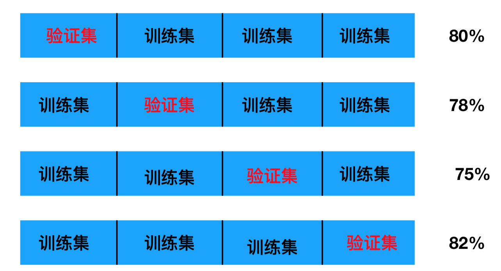

#### 2. 为什么需要交叉验证
交叉验证目的是为了让被评估的模型更加准确可信，因为偶然概率很大。

#### 3. 什么是网格搜索
通常情况下，有很多参数是需要手动指定的（如k-近邻算法中的K值），这种叫超参数。但是手动过程繁杂，所以需要对模型预设几种超参数组合。每组超参数都采用交叉验证来进行评估。最后选出最优参数组合建立模型。让手动挡变成自动挡。

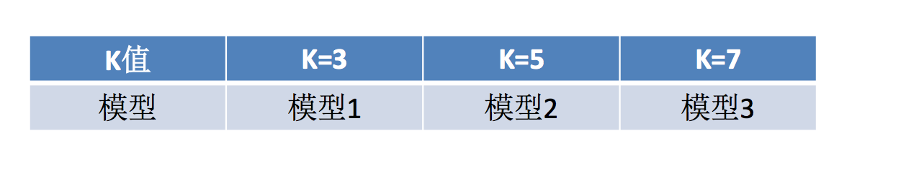

#### 4. 调优API
- sklearn.model_selection.GridSearchCV(estimator, param_grid=None,cv=None)
    - 对估计器的指定参数值进行详尽搜索
    - estimator：估计器对象
    - param_grid：估计器参数(dict){“n_neighbors”:[1,3,5]}
    - cv：指定几折交叉验证
    - fit：输入训练数据
    - score：准确率
    - 结果分析：
        - bestscore__:在交叉验证中验证的最好结果
        - bestestimator：最好的参数模型
        - cvresults:每次交叉验证后的验证集准确率结果和训练集准确率结果


## 3.1.5 误差
误差是指测量值与真实值之间的差距，误差的大小反映了实验、观察、测量和近似计算等所得结果的精确程度。误差的绝对值越小，精确程度越高。

近似误差：对现有训练集的训练误差，关注训练集，如果近似误差过小可能会出现过拟合的现象，对现有的训练集能有很好的预测，但是对未知的测试样本将会出现较大偏差的预测。模型本身不是最接近最佳模型。

估计误差：对测试集的测试误差，关注测试集，估计误差小说明对未知数据的预测能力好，模型本身最接近最佳模型。

## 3.1.6 KD树
实现knn时，主要是如何对训练数据进行快速搜索，快速找到周围的样本做统计预测。

如果在海量的训练数据，且维数较大时，高效率的搜索尤其必要。

K近邻简单的实现就是通过线性扫描（穷举搜索），和每一个训练数据的距离做计算，计算后再查找k近邻。数据集很大时，计算非常耗时。

为了提高KNN搜索效率，从而使用KD树结构存储训练数据，减少计算距离次数，实现高效搜索。

### 1. 什么是KD树
线性扫描时，计算成本非常高，针对N个样本，D个特征的数据集，其算法复杂度为O（DN^2）。

kd树为了避免全部计算，算法会把距离信息存储在一个树里，计算之前先从树里查询距离信息，尽量避免重新计算。其基本原理是，如果A和B距离**很远**，B和C距离**很近**，那么A和C的距离也很远。有了这个信息，就可以在合适的时候跳过距离远的点。

这样优化后的算法复杂度可降低到O（DNlog（N））。

### 2. KD树原理

先看二叉树结构，通过构建二叉树，使检索速度提升

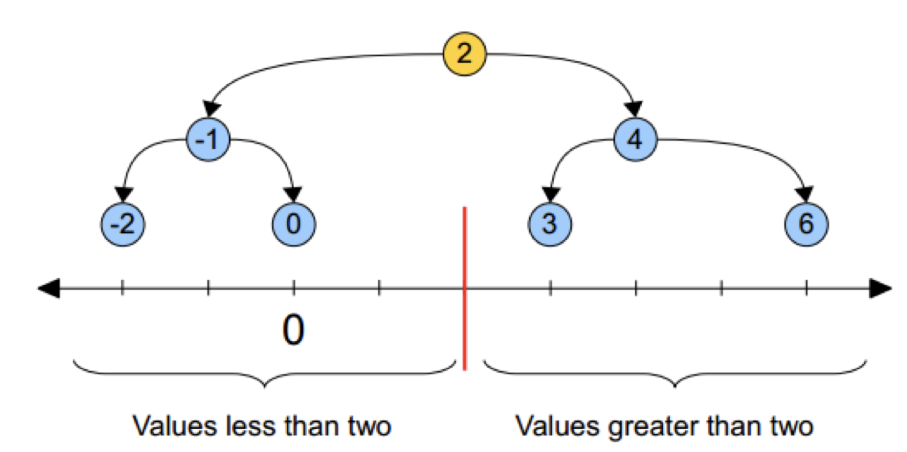

KD树类似这个思路，黄色的点作为根节点，上面的点归左子树，下面的点归右子树，接下来再不断地划分，分割的那条线叫做分割超平面（splitting hyperplane），在一维中是一个点，二维中是线，三维的是面。

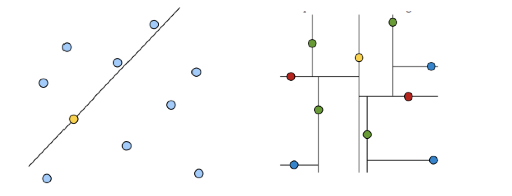

黄色节点就是Root节点，下一层是红色，再下一层是绿色，再下一层是蓝色。

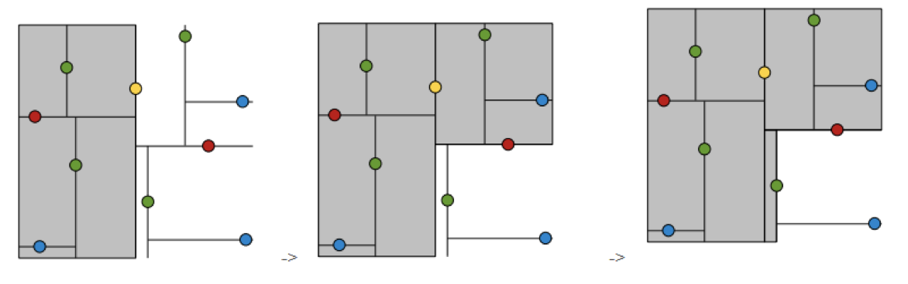

在一组数据中，根据距离，尽可能将点数平均的划分为多个区域。

#### 1. 树的建立
给定一个二维空间数据集：T={(2,3),(5,4),(9,6),(4,7),(8,1),(7,2)}，构造一个平衡kd树。

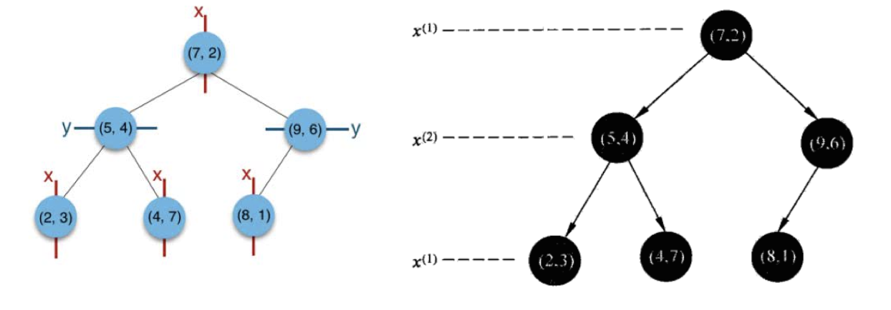

根结点对应包含数据集T的矩形，选择x(1)轴，6个数据点的x(1)坐标中位数是6，这里选最接近的(7,2)点，以平面x(1)=7将空间分为左、右两个子矩形（子结点）；接着左矩形以x(2)=4分为两个子矩形（左矩形中{(2,3),(5,4),(4,7)}点的x(2)坐标中位数正好为4），右矩形以x(2)=6分为两个子矩形，如此递归，最后得到如下图所示的特征空间划分和kd树。

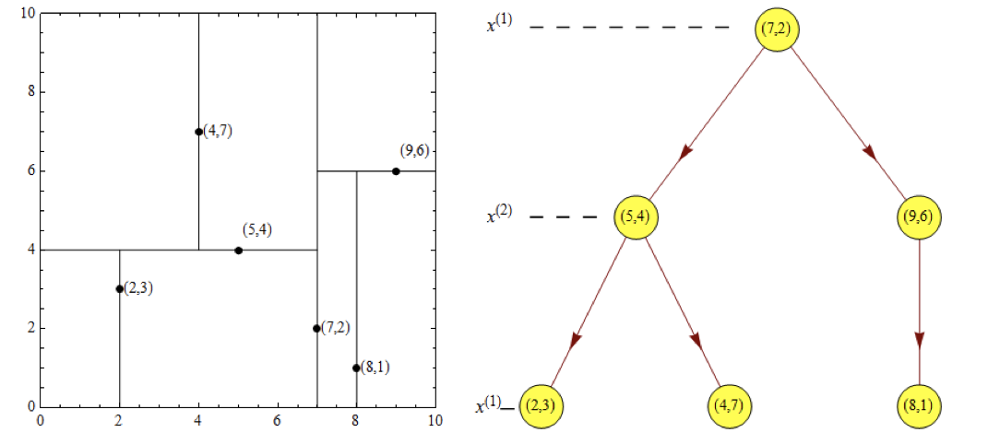

#### 2. 近邻搜索
假设标记为星星的点是 test point， 绿色的点是找到的近似点，在回溯过程中，需要用到一个队列，存储需要回溯的点，在判断其他子节点空间中是否有可能有距离查询点更近的数据点时，做法是以查询点为圆心，以当前的最近距离为半径画圆，这个圆称为候选超球（candidate hypersphere），**如果圆与回溯点的轴相交，则需要将轴另一边的节点都放到回溯队列里面来。**

样本集{(2,3),(5,4), (9,6), (4,7), (8,1), (7,2)}

**1. 查找点(2.1,3.1)**

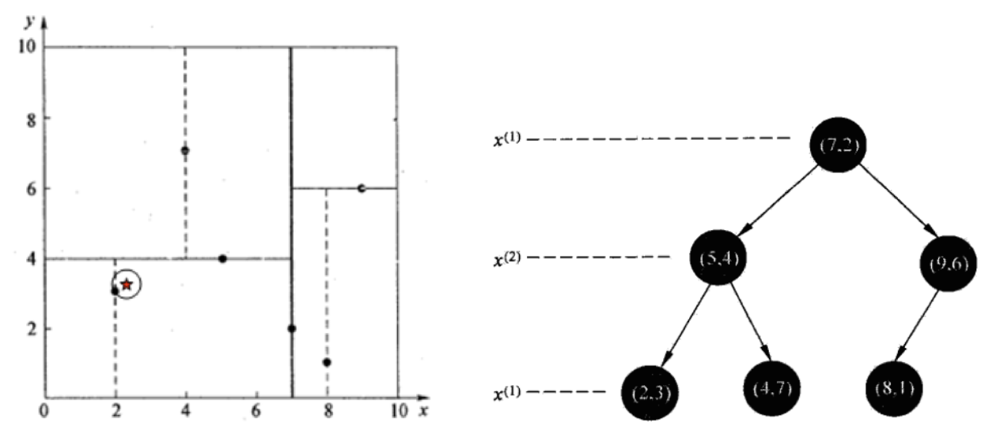

在(7,2)点测试到达(5,4)，在(5,4)点测试到达(2,3)，然后search_path（搜索路径）的结点为 <(7,2),(5,4), (2,3)>，从search_path（搜索路径）中取出(2,3)作为当前最佳结点nearest, dist（计算欧式距离）为0.141；

然后回溯至(5,4)，以(2.1,3.1)为圆心，以dist=0.141为半径画一个圆，发现并不和超平面y=4相交，如上图，所以不必跳到结点(5,4)的右子空间去搜索，减少区域范围，因为右子空间中不可能有更近样本点了。

于是再回溯至(7,2)，同理，以(2.1,3.1)为圆心，以dist=0.141为半径画一个圆，发现并不和超平面x=7相交，所以也不用跳到结点(7,2)的右子空间去搜索。

至此，search_path为空，结束整个搜索，返回nearest(2,3)作为(2.1,3.1)的最近邻点，最近距离为0.141。

**2. 查找点(2,4.5)**

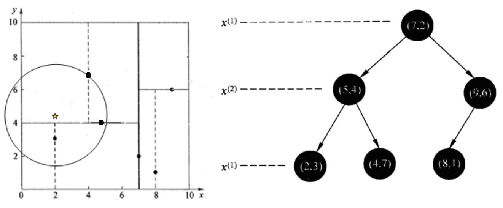

在(7,2)处测试到达(5,4)，在(5,4)处测试到达(4,7)【优先选择在本域搜索】，然后search_path中的结点为<(7,2),(5,4), (4,7)>，从search_path中取出(4,7)作为当前最佳结点nearest, dist为3.202；

然后回溯至(5,4)，以(2,4.5)为圆心，以dist=3.202为半径画一个圆与超平面y=4相交，所以需要跳到(5,4)的左子空间去搜索。所以要将(2,3)加入到search_path中，现在search_path中的结点为<(7,2),(2, 3)>；另外，(5,4)与(2,4.5)的距离为3.04 < dist = 3.202，所以将(5,4)赋给nearest，并且dist=3.04。

回溯至(2,3)，因为(2,3)是叶子节点，所以直接判断(2,3)是否离(2,4.5)更近，计算得到距离为1.5，所以nearest更新为(2,3)，dist更新为(1.5)

回溯至(7,2)，同理，以(2,4.5)为圆心，以dist=1.5为半径画一个圆并不和超平面x=7相交, 所以不用跳到结点(7,2)的右子空间去搜索。

至此，search_path为空，结束整个搜索，返回nearest(2,3)作为(2,4.5)的最近邻点，最近距离为1.5。

**3. 找k个值**

案例流程讲述寻找一个点的过程，但KNN要求找出k个最近邻点，为了实现这个要求，我们需要维护一个大根堆

当出现一个距离更近的样本时，如果大根堆中的节点数量还不足k个，则增加一个节点并排序，如果大根堆已经有k个节点，则对比该样本的距离与大根堆中的根节点的距离，如果大于根节点距离，则不改变大根堆，如果小于该距离，则替换后再进行一次排序，顺着链路比较距离重复此操作。简单来说就是替换最大值。

有一棵 KD 树包含 6 个点 A(2, 3)、B(5, 4)、C(9, 6)、D(4,7)、E(8, 1)、F(7, 2)，需要查询离 p(6, 6) 最近的两个点。

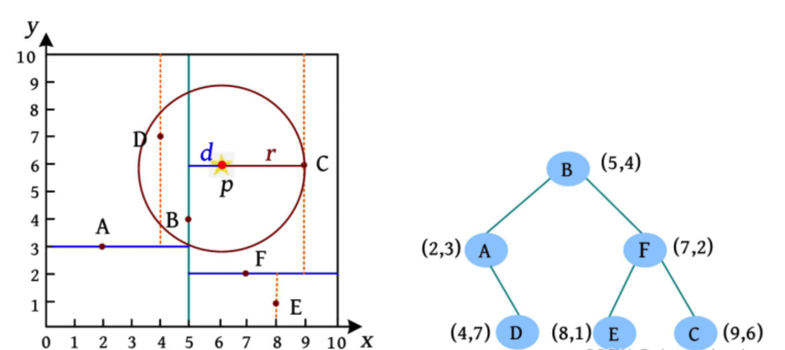

查询过程如下：

1. 当前维度为 x ，p 的 x 坐标大于树根 B，在B的右子树中查询。
2. 当前维度为 y ，p 的 y 坐标大于树根 F，在 F 的右子树中查询。
3. 当前维度为 x ，p 的 x 坐标小于树根 C，在 C 的左子树中查询。
4. C 的左子树为空，优先队列元素个数小于2，C 入队。
5. C 的右子树为空，返回到 F，优先队列的元素个数小于2，F 入队，搜索 F 的左子树。
6. F的左子树 E 到 p 的距离比队列中的最远点大，无须入队。
7. 返回到 B，B 到 p 的距离比队列中的最远点小，F 出队，B入队。
8. 以 p 为球心 且 p 到队列中最远点的距离为半径的超球体与划分点 B 的另一区域有交集（d<r），B 左侧区域的点有可能离 p 更近，需要继续查询 B 的另一区域（左子树）。
9. 在 B 的左子树中，D 到 p 的距离比队列中的最远点小，C 出队，D 入队。
10. 距离 p 点最近的两个点为 D、B。

由此可见，kd树检索效率比线性扫描快很多，但kd树有一些缺陷，比如当特征数量很多，即维度很大时，其搜索的效率其实是严重下降的，因此就诞生了更高级的球树搜索。

一般的在特征向量维度小于20的时候是可以用KD-Tree的，但是更高维度的时候建议使用Ball-Tree，这种算法的效率更高

## 3.1.7 球树（Ball Tree）
### 1. 什么是球树
球树的结构与kd树类似，同样是一个二叉树

### 2. 球树的原理

#### 1. 球树的建立
根节点选择方式如下：
找到一个中心点，使所有样本点到这个中心点的距离最短。

对于每一个节点的子节点的选择，方式如下：

1. 选择当前超球体区域离中心最远的点作为左子节点
2. 选择距离左子节点距离最远的点作为右子节点
3. 对于其他的样本点，计算到左子节点和右子节点对应样本点的欧式距离，并分配到距离较近的那一个
4. 对所有子节点做相同的操作
5. 到达设定的阈值r<=2（假设值），停止球体分割

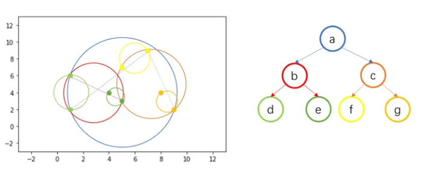

球树的每个节点中，需要包含的信息如下：

- 该节点包含的样本点的信息
- 该节点超球体的圆心坐标
- 该节点超球体的半径

#### 2. 球树搜索
球树搜索和kd树类似，球数多了查找范围R，最近邻点需要在测试样本点周围半径为 R 的超球体内，在下图中就是黑色的超球体。

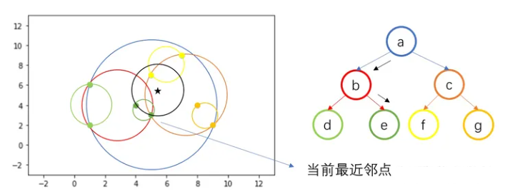

测试样本点与超球体 b 相交，则向下访问节点 b，继续往下搜索，发现与超球体 d 不相交，则搜索另一分支，与超球体 e 相交，则向下访问至 e。

因 e 中存在两个训练样本点，计算两个样本点与 Z 之间的距离，得到当前最近邻点（5, 3）。

接着回退父节点 b，不同于 kd 树，因为所有训练样本点都包含在叶节点中，即子节点包含的训练样本点为它们的父节点包含训练样本点的子集，因此回退到父节点后没有需要计算距离的样本，因此继续回退到根节点 a。

回退到根节点 a 后，搜索另一个分支 c，由于与 c 相交，因此向下访问 c，继续搜索，与 f 相交，向下访问 f，计算叶节点 f 中包含的训练样本点与测试样本点之间的距离，更新当前最近邻点为（5, 7）。

叶节点 f 搜索完毕，回退父节点 c，搜索另一分支 g，发现不相交，回退到根节点 a，所有分支搜索完毕，得到最近邻点（5, 7）。


## 3.1.8 KNN算法优缺点

- 优点：
  - 简单有效
  - 重新训练的代价低
  - 适合类域交叉样本
    - KNN方法主要靠周围有限的邻近的样本,而不是靠判别类域的方法来确定所属类别的，因此对于类域的交叉或重叠较多的待分样本集来说，KNN方法较其他方法更为适合。
  - 适合大样本自动分类
    - 该算法比较适用于样本容量比较大的类域的自动分类，而那些样本容量较小的类域采用这种算法比较容易产生误分。

- 缺点

  - 惰性学习
    - KNN算法是懒散学习方法（lazy learning,基本上不学习），一些积极学习的算法要快很多
  - 类别评分不是规格化
    - 不像一些通过概率评分的分类
  - 输出可解释性不强
    - 例如决策树的输出可解释性就较强
  - 对不均衡的样本不擅长
    - 当样本不平衡时，如一个类的样本容量很大，而其他类样本容量很小时，有可能导致当输入一个新样本时，该样本的K个邻居中大容量类的样本占多数。该算法只计算“最近的”邻居样本，某一类的样本数量很大，那么或者这类样本并不接近目标样本，或者这类样本很靠近目标样本。无论怎样，数量并不能影响运行结果。可以采用权值的方法（和该样本距离小的邻居权值大）来改进。
  - 计算量较大
    - 目前常用的解决方法是事先对已知样本点进行剪辑，事先去除对分类作用不大的样本。