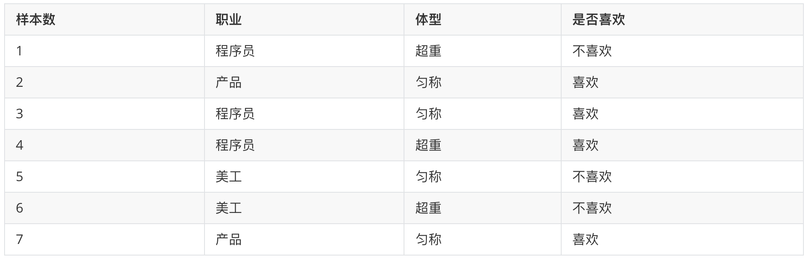
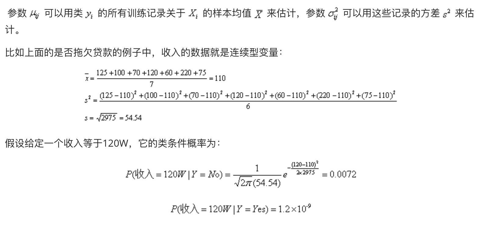

# 3.3 朴素贝叶斯算法

## 3.3.1 朴素贝叶斯概念
**朴素贝叶斯（Naive Bayes ）** 是基于贝叶斯定理与特征条件独立假设的分类算法。朴素贝叶斯分类器发源于古典数学理论，有着坚实的数学基础，以及稳定的分类效率。同时，模型所需估计的参数很少，对缺失数据不太敏感，算法也比较简单。

## 3.3.2 朴素贝叶斯分类原理

### 1. 概率公式

#### 1. 条件概率
表示事件A在另外一个事件B已经发生条件下的发生概率，P(A|B)

在女生喜欢的条件下，职业是程序员的概率？

1. 女神喜欢条件下，有 2、3、4、7 共 4 个样本
2. 4 个样本中，有程序员 3、4 共 2 个样本
3. 则 P(程序员|喜欢) = 2/4 = 0.5

#### 2. 联合概率
表示多个条件同时成立的概率，P(AB)   =  P(A)   P(B|A)    
特征条件独立性假设：P(AB) = P(A) P(B)

职业是程序员并且体型匀称的概率？

1. 数据集中，共有 7 个样本	
2. 职业是程序员有 1、3、4 共 3 个样本，则其概率为：3/7
3. 在职业是程序员，体型是匀称有 3  共 1 个样本，则其概率为：1/3
4. 则即是程序员又体型匀称的概率为：3/7 \* 1/3 = 1/7

#### 3. 联合概率 + 条件概率

在女神喜欢的条件下，职业是程序员、体重超重的概率？  P(AB|C) = P(A|C) P(B|AC)

1. 在女神喜欢的条件下，有 2、3、4、7 共 4 个样本
2. 在这 4 个样本中，职业是程序员有 3、4 共 2 个样本，则其概率为：2/4=0.5
3. 在在 2 个样本中，体型超重的有 4 共 1 个样本，则其概率为：1/2 = 0.5
4. 则 P(程序员, 超重|喜欢) = 0.5 \* 0.5 = 0.25

> 简言之：
> 
> 条件概率：在去掉部分样本的情况下，计算某些样本的出现的概率，表示为：P(B|A)
> 
> 联合概率：多个事件同时发生的概率是多少，表示为：P(AB) = P(B)*P(A|B)

### 2. 贝叶斯公式

1. P(C) 表示 C 出现的概率
2. P(W|C) 表示 C 条件 W 出现的概率
3. P(W) 表示 W 出现的概率

1. P(C|W) = P(喜欢|程序员，超重)
2. P(W|C) = P(程序员，超重|喜欢)
3. P(C) = P(喜欢)
4. P(W) = P(程序员，超重)

1. 根据训练样本估计先验概率P(C)：P(喜欢) = 4/7
2. 根据条件概率P(W|C)调整先验概率：P(程序员,超重|喜欢) = 1/4
3. 此时我们的后验概率P(C|W)为：P(程序员,超重|喜欢) \* P(喜欢) = 4/7 \* 1/4 = 1/7 
4. 那么该部分数据占所有既为程序员，又超重的人中的比例是多少呢？
   1. P(程序员,超重) = P(程序员) \* P(超重|程序员) = 3/7 \* 2/3 = 2/7
   2. P(喜欢|程序员, 超重) = 1/7 ➗ 2/7 = 0.5

### 3. 朴素贝叶斯公式
在前面的贝叶斯概率计算过程中，需要计算 P(程序员,超重|喜欢) 和 P(程序员, 超重) 等联合概率，为了简化联合概率的计算，朴素贝叶斯在贝叶斯基础上增加：**特征条件独立假设**，即：特征之间是互为独立的。

此时，联合概率的计算即可简化为：

1. P(程序员,超重|喜欢)  = P(程序员|喜欢) \* P(超重|喜欢)
2. P(程序员,超重) = P(程序员) \* P(超重)

### 4. 拉普拉斯平滑系数
由于训练样本的不足，导致概率计算时出现 0 的情况。为了解决这个问题，我们引入了拉普拉斯平滑系数。

1. α 是拉普拉斯平滑系数，一般指定为 1
2. Ni 是 F1 中符合条件 C 的样本数量
3. N 是在条件 C 下所有样本的总数
4. m 表示 **所有独立样本** 的总数

我们只需要知道为了避免概率值为 0，我们在分子和分母分别加上一个数值，这就是拉普拉斯平滑系数的作用。

## 3.3.3 朴素贝叶斯案例
预测一个贷款者是否会拖欠还款，我们基于以下图表做分析，假设有一组测试记录X={有房=否，婚姻状况=已婚，年收入=120W}，要分类该记录，我们需要利用训练数据中的可用信息计算后验概率P(Yes|X)和P(No|X)，如果P(Yes|X)>P(No|X)，那么记录分类为Yes，反之为No。

### 1. 首先分析各维度数据的类型
有房：二元变量，婚否：分类变量，年收入：连续变量，拖欠贷款：类变量

| Tid  | 有房 | 婚否 | 年收入 | 拖欠贷款 |
| ---- | ---- | ---- | ------ | -------- |
| 1    | 是   | 单身 | 125    | 否       |
| 2    | 否   | 已婚 | 100    | 否       |
| 3    | 否   | 单身 | 70     | 否       |
| 4    | 是   | 已婚 | 120    | 否       |
| 5    | 否   | 离异 | 95     | 是       |
| 6    | 否   | 已婚 | 60     | 否       |
| 7    | 是   | 离异 | 220    | 否       |
| 8    | 否   | 单身 | 85     | 是       |
| 9    | 否   | 已婚 | 75     | 否       |
| 10   | 否   | 单身 | 90     | 是       |

准确估计类标号和属性值的每一种可能组合的后验概率非常困难，因为即便属性数目不是很大，仍然需要很大的训练集。此时，我们采用贝叶斯就比较方便，它允许我们使用先验概率P(Y)、类条件概率p(X|Y)表示后验概率：

上式中的，分母P(X)通过全概率公式可计算得出，结果是常数，通常实践中可忽略。P(Y)先验概率可以通过计算训练集中属于每个类的训练记录所占的比例计算。p(X|Y)的估计常用的有两种估计方法：朴素贝叶斯和贝叶斯网络。

### 2. 条件独立
朴素贝叶斯是基于上述的 **贝叶斯定理与特征条件独立** 的分类方法。朴素贝叶斯对条件概率分布做了条件独立性假设，由于这是一个较强的假设，朴素贝叶斯也由此得名。

给定Z,X条件独立于Y，则有下面条件独立

P(X|Y,Z)=P(X|Z)

比如一个人的手臂长短和它的阅读能力之间的关系，你可能会发现手臂较长的人阅读能力较强。这种关系可以用另外一个因素去解释，那就是年龄。小孩子的手臂往往比较短，也不具备成年人的阅读能力。如果年龄一定，则观察到的手臂长度和阅读能力之间的关系消失了。也就是如果年龄一定，手臂长度和阅读能力两者条件独立。

条件独立假设等于说是用于分类的特征在类确定的条件下都是条件独立的，这一假设使得朴素贝叶斯算法变得简单，但是有时会牺牲一定的分类准确率。

朴素贝叶斯实际上学习到生成数据的机制，所以属于生成模型。

朴素贝叶斯分类时，对给定的输入x，通过学习到的模型计算后验概率分布P(Y=c|X=x)，将后验概率最大的类作为x的类输出。后验概率计算根据上述的贝叶斯定理进行：

将上面公式（1）代入上式得到朴素贝叶斯公式

上式中的分母对所有的类别都是相同的，因此只需要当分子取最大值时即可

### 3. 分类属性的条件概率
分类属性*Xi*，我们只需要根据类y中属性值等于*Xi*的训练实例的比例来估计的条件概率。比如上面的是否拖欠贷款的例子中P(婚否=单身|Yes拖欠)=2/3。

请大家自行算其他分类属性的条件概率。

### 4. 连续属性的条件概率
我们采用假设连续变量服从某种概率分布，然后使用训练数据估计分布的参数。高斯分布被用来表示连续属性的类条件概率分布，如下表示每个类*Yi*，属性Xi的类条件概率为：

## 3.3.4 朴素贝叶斯算法API

TODO：等找到好例子再写