# 4.1 距离度量
## 4.1.1 欧式距离
两点直接最短距离就是指欧式距离。

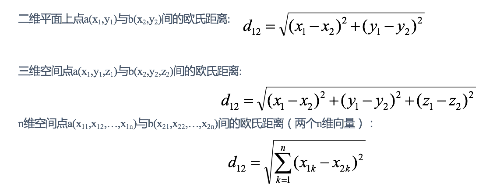

## 4.1.2 曼哈顿距离
在曼哈顿街区要从一个十字路口开车到另一个十字路口，驾驶距离显然不是两点间的直线距离。这个实际驾驶距离就是“曼哈顿距离”。曼哈顿距离也称为“城市街区距离”(City Block distance)。

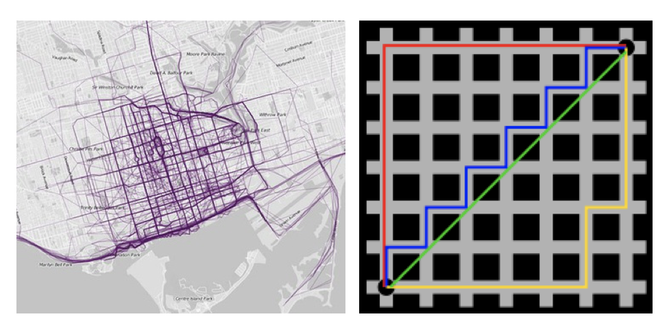
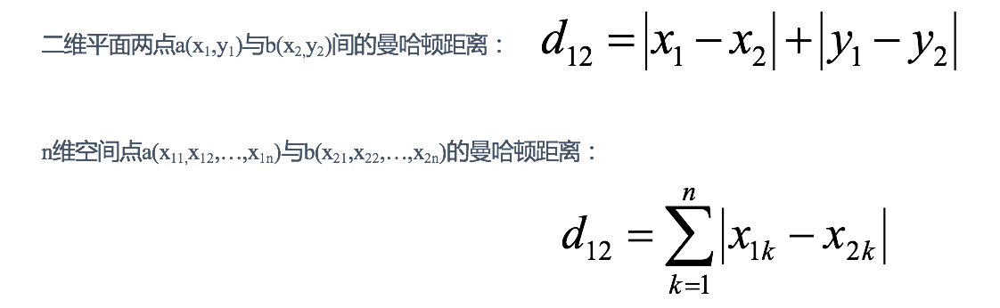

## 4.1.3 切比雪夫距离
国际象棋中，国王可以直行、横行、斜行，所以国王走一步可以移动到相邻8个方格中的任意一个。国王从格子(x1,y1)走到格子(x2,y2)最少需要多少步？这个距离就叫切比雪夫距离。
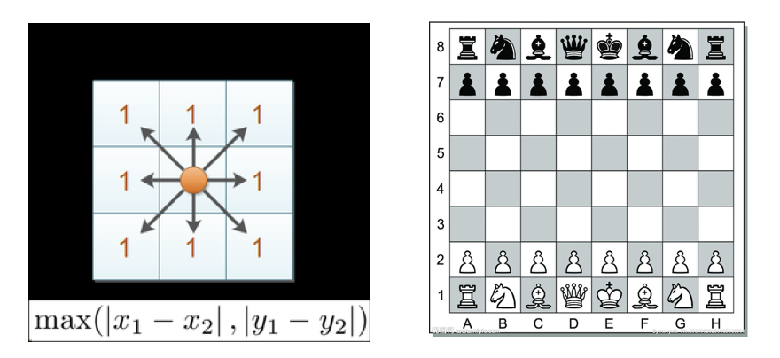
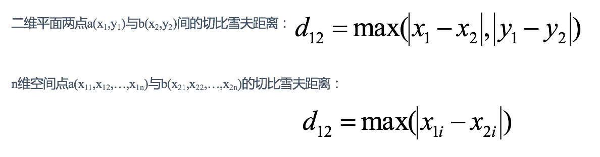

## 4.1.4 闵可负斯基距离
闵氏距离不是一种距离，而是一组距离的定义，是对多个距离度量公式的概括性的表述。

两个n维变量a(x11,x12,…,x1n)与b(x21,x22,…,x2n)间的闵可夫斯基距离定义为：

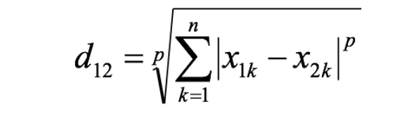

其中p是一个变参数：

当p=1时，就是曼哈顿距离；

当p=2时，就是欧氏距离；

当p→∞时，就是切比雪夫距离。

根据p的不同，闵氏距离可以表示某一类/种的距离。

1. 闵氏距离，包括曼哈顿距离、欧氏距离和切比雪夫距离都存在明显的缺点:  
- e.g. 二维样本(身高[单位:cm],体重[单位:kg]),现有三个样本：a(180,50)，b(190,50)，c(180,60)。  
- a与b的闵氏距离（无论是曼哈顿距离、欧氏距离或切比雪夫距离）等于a与c的闵氏距离。但实际上身高的10cm并不能和体重的10kg划等号。

2. 闵氏距离的缺点：
- 将各个分量的量纲(scale)，也就是“单位”相同的看待了;
- 未考虑各个分量的分布（期望，方差等）可能是不同的。

## 4.1.5 标准化欧氏距离
标准化欧氏距离是针对欧氏距离的缺点而作的一种改进。

既然数据各维分量的分布不一样，那先将各个分量都“标准化”到均值、方差相等。假设样本集X的均值(mean)为m，标准差(standard deviation)为s，X的“标准化变量”表示为：

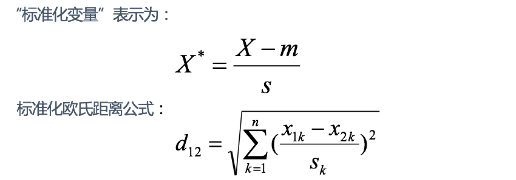

如果将方差的倒数看成一个权重，也可称之为加权欧氏距离(Weighted Euclidean distance)。

## 4.1.6 余弦距离
几何中，夹角余弦可用来衡量两个向量方向的差异；机器学习中，借用这一概念来衡量样本向量之间的差异。
- 二维空间中向量A(x1,y1)与向量B(x2,y2)的夹角余弦公式：

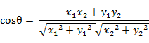

- 两个n维样本点a(x11,x12,…,x1n)和b(x21,x22,…,x2n)的夹角余弦为：

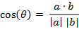

即：

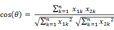

夹角余弦取值范围为[-1,1]。余弦越大表示两个向量的夹角越小，余弦越小表示两向量的夹角越大。当两个向量的方向重合时余弦取最大值1，当两个向量的方向完全相反余弦取最小值-1。

## 4.1.7 汉明距离
两个等长字符串s1与s2的汉明距离为：将其中一个变为另外一个所需要作的最小字符替换次数。

例如：
> "1011101" and "1001001" is 2
> 
> "2143896" and "2233796" is 3
> 
> "toned" and "roses" is 3

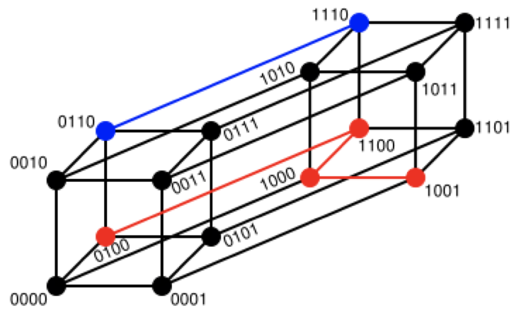

## 4.1.8 杰卡德距离
杰卡德相似系数(Jaccard similarity coefficient)：两个集合A和B的交集元素在A，B的并集中所占的比例，称为两个集合的杰卡德相似系数，杰卡德系数越高，则两个样本相似度越高。用符号J(A,B)表示：

杰卡德距离(Jaccard Distance)：与杰卡德相似系数相反，杰卡德距离越大，两个样本相似度越低。用两个集合中不同元素占所有元素的比例来衡量两个集合的区分度：

## 4.1.9 马氏距离
马氏距离(Mahalanobis Distance)是一种距离的度量，可以看作是欧氏距离的一种修正，修正了欧式距离中各个维度尺度不一致且相关的问题。

两个正态分布图，它们的均值分别为a和b，但方差不一样，则图中的A点离哪个总体更近？或者说A有更大的概率属于谁？显然，A离左边的更近，A属于左边总体的概率更大，尽管A与a的欧式距离远一些。这就是马氏距离的直观解释。

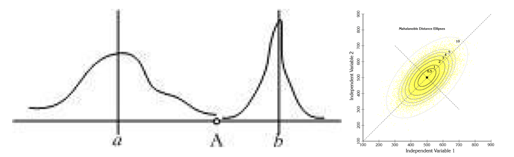

马氏距离是基于样本分布的一种距离。

马氏距离是由印度统计学家马哈拉诺比斯提出的，表示数据的协方差距离。它是一种有效的计算两个位置样本集的相似度的方法。

与欧式距离不同的是，它考虑到各种特性之间的联系，即独立于测量尺度。

马氏距离定义：设总体G为m维总体（考察m个指标），均值向量为μ=（μ1，μ2，… ...，μm，）`,协方差阵为∑=（σij）,

则样本X=（X1，X2，… …，Xm，）`与总体G的马氏距离定义为：

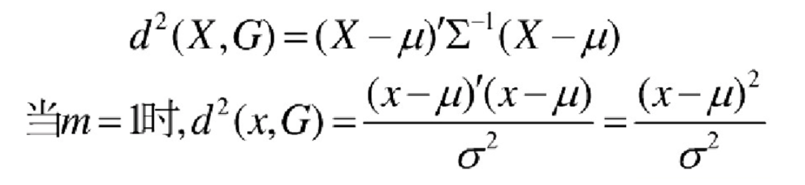

马氏距离也可以定义为两个服从同一分布并且其协方差矩阵为∑的随机变量的差异程度：如果协方差矩阵为单位矩阵，马氏距离就简化为欧式距离；如果协方差矩阵为对角矩阵，则其也可称为正规化的欧式距离。