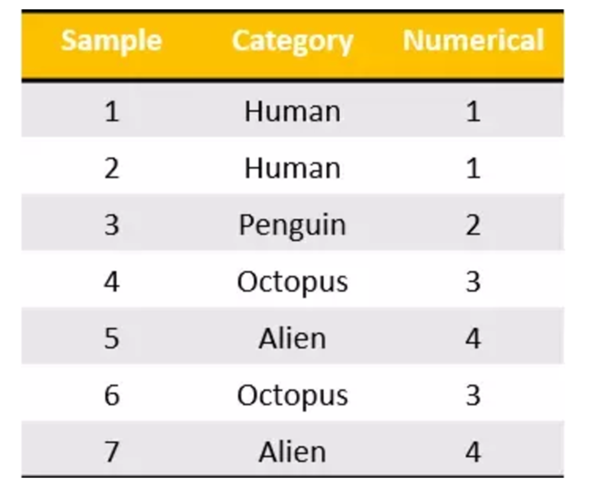
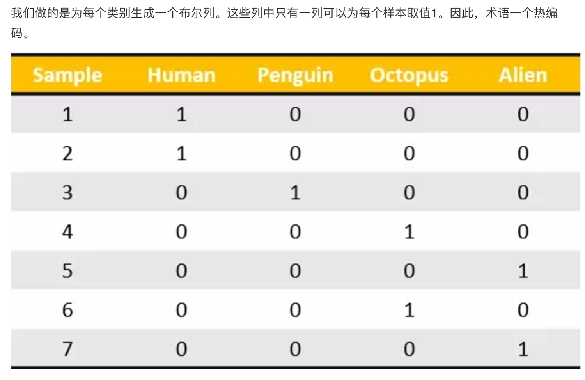
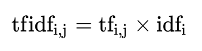

# 4.2 特征工程

## 4.2.1 特征提取


### 1. 特征提取介绍
将任意数据（如文本或图像）转换为可用于机器学习的数字特征

> 特征值化是为了计算机更好的去理解数据

- 特征提取分类:
  - 字典特征提取(特征离散化)
  - 文本特征提取
  - 图像特征提取（深度学习介绍）

在本书示例Sklearn包中，特征提取的API如下：
```py
sklearn.feature_extraction
```


### 2. 字典特征提取

对以下数据进行特征抽取
```
[{'city': '北京','temperature':100},
{'city': '上海','temperature':60},
{'city': '深圳','temperature':30}]
```
代码示例：
```py
from sklearn.feature_extraction import DictVectorizer

if __name__ == '__main__':
    data = [{'city': '北京','temperature':100}, {'city': '上海','temperature':60}, {'city': '深圳','temperature':30}]
    # 1、实例化一个转换器类
    transfer = DictVectorizer(sparse=False)
    # 2、调用fit_transform
    data = transfer.fit_transform(data)
    print("返回的结果:\n", data)
    # 打印特征名字
    print("特征名字：\n", transfer.get_feature_names())
```
输出结果为：
```py
返回的结果:
 [[  0.   1.   0. 100.]
 [  1.   0.   0.  60.]
 [  0.   0.   1.  30.]]
特征名字：
 ['city=上海', 'city=北京', 'city=深圳', 'temperature']
```

我们把这个处理数据的技巧叫做”one-hot“编码：


转化为：



对于特征当中存在类别信息的我们都会做one-hot编码处理


### 3. 文本特征提取

对以下数据进行特征抽取

```
["life is short,i like python",
"life is too long,i dislike python"]
```
代码示例：
```py
from sklearn.feature_extraction.text import CountVectorizer

if __name__ == '__main__':
    data = ["life is short,i like like python", "life is too long,i dislike python"]
    # 1、实例化一个转换器类
    transfer = CountVectorizer()
    # 2、调用fit_transform
    data = transfer.fit_transform(data)
    print("文本特征抽取的结果：\n", data.toarray())
    print("返回特征名字：\n", transfer.get_feature_names())
```
输出结果为：
```py
文本特征抽取的结果：
 [[0 1 1 2 0 1 1 0]
 [1 1 1 0 1 1 0 1]]
返回特征名字：
 ['dislike', 'is', 'life', 'like', 'long', 'python', 'short', 'too']
```
**数据需要用空格分开，英文默认空格分开的，达到了分词的效果，中文需要借助分词器**

### 4. jieba分词文本特征提取
需要安装jieba库
```shell
pip3 install jieba
```

示例代码：
```py
from sklearn.feature_extraction.text import CountVectorizer
import jieba

def cut_word(text):
    # 用结巴对中文字符串进行分词
    text = " ".join(list(jieba.cut(text)))
    return text

if __name__ == '__main__':
    data = ["一种还是一种今天很残酷，明天更残酷，后天很美好，但绝对大部分是死在明天晚上，所以每个人不要放弃今天。",
            "我们看到的从很远星系来的光是在几百万年之前发出的，这样当我们看到宇宙时，我们是在看它的过去。",
            "如果只用一种方式了解某样事物，你就不会真正了解它。了解事物真正含义的秘密取决于如何将其与我们所了解的事物相联系。"]
    # 将原始数据转换成分好词的形式
    text_list = []
    for sent in data:
        text_list.append(cut_word(sent))
    print(text_list)

    # 1、实例化一个转换器类
    transfer = CountVectorizer()
    # 2、调用fit_transform
    data = transfer.fit_transform(text_list)
    print("文本特征抽取的结果：\n", data.toarray())
    print("返回特征名字：\n", transfer.get_feature_names())
```
运行结果：
```py
['一种 还是 一种 今天 很 残酷 ， 明天 更 残酷 ， 后天 很 美好 ， 但 绝对 大部分 是 死 在 明天 晚上 ， 所以 每个 人 不要 放弃 今天 。', '我们 看到 的 从 很 远 星系 来 的 光是在 几百万年 之前 发出 的 ， 这样 当 我们 看到 宇宙 时 ， 我们 是 在 看 它 的 过去 。', '如果 只用 一种 方式 了解 某样 事物 ， 你 就 不会 真正 了解 它 。 了解 事物 真正 含义 的 秘密 取决于 如何 将 其 与 我们 所 了解 的 事物 相 联系 。']
文本特征抽取的结果：
 [[2 0 1 0 0 0 2 0 0 0 0 0 1 0 1 0 0 0 0 1 1 0 2 0 1 0 2 1 0 0 0 1 1 0 0 1
  0]
 [0 0 0 1 0 0 0 1 1 1 0 0 0 0 0 0 0 1 3 0 0 0 0 1 0 0 0 0 2 0 0 0 0 0 1 0
  1]
 [1 1 0 0 4 3 0 0 0 0 1 1 0 1 0 1 1 0 1 0 0 1 0 0 0 1 0 0 0 2 1 0 0 1 0 0
  0]]
返回特征名字：
 ['一种', '不会', '不要', '之前', '了解', '事物', '今天', '光是在', '几百万年', '发出', '取决于', '只用', '后天', '含义', '大部分', '如何', '如果', '宇宙', '我们', '所以', '放弃', '方式', '明天', '星系', '晚上', '某样', '残酷', '每个', '看到', '真正', '秘密', '绝对', '美好', '联系', '过去', '还是', '这样']
```
jieba把句子分成多个词，然后做文本特征抽取

### 5. Tf-idf文本特征提取
- TF-IDF的主要思想是：如果某个词或短语在一篇文章中出现的概率高，并且在其他文章中很少出现，则认为此词或者短语具有很好的类别区分能力，适合用来分类。
- TF-IDF作用：用以评估一字词对于一个文件集或一个语料库中的其中一份文件的重要程度。
#### 1. 公式
- 词频（term frequency，tf）指的是某一个给定的词语在该文件中出现的频率
- 逆向文档频率（inverse document frequency，idf）是一个词语普遍重要性的度量。某一特定词语的idf，可以由总文件数目除以包含该词语之文件的数目，再将得到的商取以10为底的对数得到



最终得出结果可以理解为重要程度。

举例：

假如一篇文章的总词语数是100个，而词语"非常"出现了5次，那么"非常"一词在该文件中的词频就是5/100=0.05。  
而计算文件频率（IDF）的方法是以文件集的文件总数，除以出现"非常"一词的文件数。  
所以，如果"非常"一词在1,0000份文件出现过，而文件总数是10,000,000份的话，  
其逆向文件频率就是lg（10,000,000 / 1,0000）=3。  
最后"非常"对于这篇文档的tf-idf的分数为0.05 * 3=0.15

#### 2. 代码示例
```py
from sklearn.feature_extraction.text import TfidfVectorizer
import jieba
def cut_word(text):
    # 用结巴对中文字符串进行分词
    text = " ".join(list(jieba.cut(text)))
    return text

if __name__ == '__main__':
    data = ["一种还是一种今天很残酷，明天更残酷，后天很美好，但绝对大部分是死在明天晚上，所以每个人不要放弃今天。",
            "我们看到的从很远星系来的光是在几百万年之前发出的，这样当我们看到宇宙时，我们是在看它的过去。",
            "如果只用一种方式了解某样事物，你就不会真正了解它。了解事物真正含义的秘密取决于如何将其与我们所了解的事物相联系。"]
    # 将原始数据转换成分好词的形式
    text_list = []
    for sent in data:
        text_list.append(cut_word(sent))
    print(text_list)

    # 1、实例化一个转换器类
    transfer = TfidfVectorizer(stop_words=['一种', '不会', '不要'])
    # 2、调用fit_transform
    data = transfer.fit_transform(text_list)
    print("文本特征抽取的结果：\n", data.toarray())
    print("返回特征名字：\n", transfer.get_feature_names())
```
返回结果：
```py
['一种 还是 一种 今天 很 残酷 ， 明天 更 残酷 ， 后天 很 美好 ， 但 绝对 大部分 是 死 在 明天 晚上 ， 所以 每个 人 不要 放弃 今天 。', '我们 看到 的 从 很 远 星系 来 的 光是在 几百万年 之前 发出 的 ， 这样 当 我们 看到 宇宙 时 ， 我们 是 在 看 它 的 过去 。', '如果 只用 一种 方式 了解 某样 事物 ， 你 就 不会 真正 了解 它 。 了解 事物 真正 含义 的 秘密 取决于 如何 将 其 与 我们 所 了解 的 事物 相 联系 。']
文本特征抽取的结果：
 [[0.         0.         0.         0.43643578 0.         0.
  0.         0.         0.         0.21821789 0.         0.21821789
  0.         0.         0.         0.         0.21821789 0.21821789
  0.         0.43643578 0.         0.21821789 0.         0.43643578
  0.21821789 0.         0.         0.         0.21821789 0.21821789
  0.         0.         0.21821789 0.        ]
 [0.2410822  0.         0.         0.         0.2410822  0.2410822
  0.2410822  0.         0.         0.         0.         0.
  0.         0.         0.2410822  0.55004769 0.         0.
  0.         0.         0.2410822  0.         0.         0.
  0.         0.48216441 0.         0.         0.         0.
  0.         0.2410822  0.         0.2410822 ]
 [0.         0.644003   0.48300225 0.         0.         0.
  0.         0.16100075 0.16100075 0.         0.16100075 0.
  0.16100075 0.16100075 0.         0.12244522 0.         0.
  0.16100075 0.         0.         0.         0.16100075 0.
  0.         0.         0.3220015  0.16100075 0.         0.
  0.16100075 0.         0.         0.        ]]
返回特征名字：
 ['之前', '了解', '事物', '今天', '光是在', '几百万年', '发出', '取决于', '只用', '后天', '含义', '大部分', '如何', '如果', '宇宙', '我们', '所以', '放弃', '方式', '明天', '星系', '晚上', '某样', '残酷', '每个', '看到', '真正', '秘密', '绝对', '美好', '联系', '过去', '还是', '这样']
```

TF-IDF是作为分类机器学习算法进行文章分类中前期数据处理方式