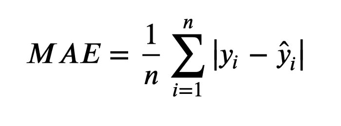
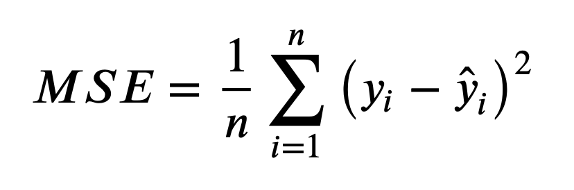
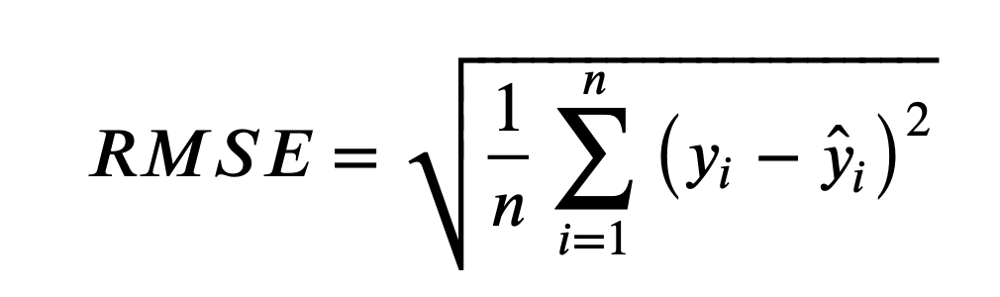
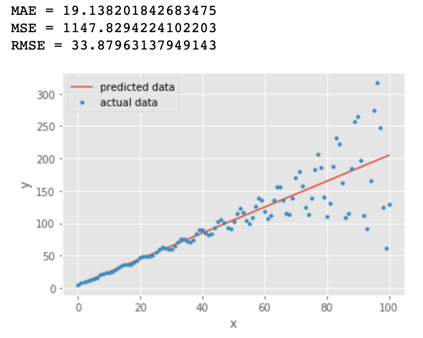
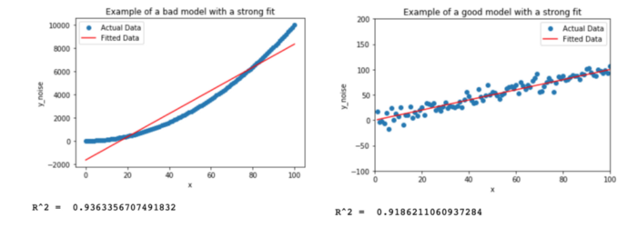
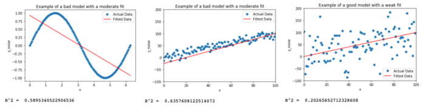
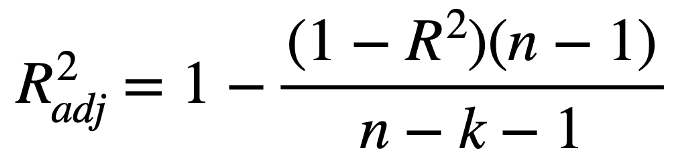
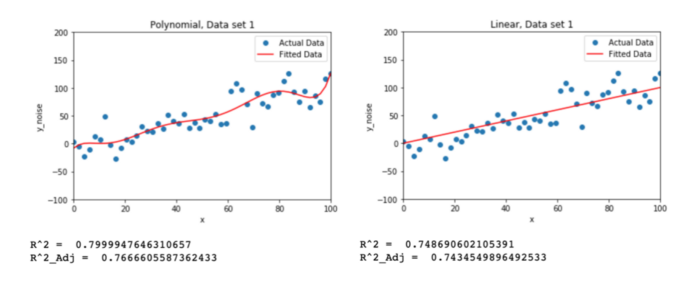
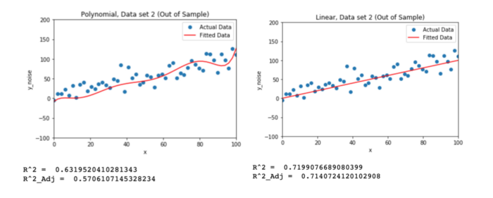

# 4.3 回归问题评估

MAE、MSE和RMSE，是不同于类别预测，不能苛刻回归预测的数值结果要严格的和真实值一致。一般情况下，我们希望衡量预测值和真实值之间的差距。因此，可以通过多种测评函数进行评价。

## 4.3.1 平均绝对误差

**Mean Absolute Error (MAE)**



- 上面的公式中：n 为样本数量, y 为实际值, $\hat{y}$ 为预测值

- MAE 越小模型预测约准确

Sklearn 中MAE的API

```python
from sklearn.metrics import mean_absolute_error
mean_absolute_error(y_test,y_predict)
```

## 4.3.2 均方误差

   **Mean Squared Error (MSE)**



- 上面的公式中：n 为样本数量, y 为实际值, $\hat{y}$ 为预测值
- MSE 越小模型预测约准确

Sklearn 中MSE的API

```python
from sklearn.metrics import mean_squared_error
mean_squared_error(y_test,y_predict)
```

## 4.3.3 均方根误差

**Root Mean Squared Error (RMSE)**



- 上面的公式中：n 为样本数量, y 为实际值, $\hat{y}$ 为预测值
- RMSE 越小模型预测约准确

- RMSE 是 MSE 的平方根。某些情况下比MES更有用，由于 MAE 和 RMSE 都是误差的一次方，可以将它们相互比较

## 4.3.4 三种指标的比较

看下面的例子

我们绘制了一条直线 **y = 2x +5** 用来拟合 **y = 2x + 5 + e.** 这些数据点，其中e为噪声


从上图中我们发现 MAE 和 RMSE 非常接近，都表明模型的误差很低（MAE 或 RMSE 越小，误差越小！）。 但是MAE 和 RMSE 有什么区别？为什么MAE较低？

- 对比MAE 和 RMSE的公式，RMSE的计算公式中有一个平方项，因此：大的误差将被平方，因此会增加 RMSE 的值

- 可以得出结论，RMSE 会放大预测误差较大的样本对结果的影响，而 MAE 只是给出了平均误差

- 由于 RMSE 对误差的 **平方和求平均** 再开根号，大多数情况下RMSE>MAE

  举例 (1+3)/2 = 2   $\sqrt{(1^2+3^2)/2 }= \sqrt{10/2} = \sqrt{5} = 2.236$

我们再看下一个例子



橙色线与第一张图中的直线一样：**y = 2x +5** 

蓝色的点为： **y = y + sin(x)\*exp(x/20) + e**  其中 exp() 表示指数函数

我们看到对比第一张图，所有的指标都变大了，RMSE 几乎是 MAE 值的两倍，因为它对预测误差较大的点比较敏感

我们是否可以得出结论： RMSE是更好的指标？ 某些情况下（希望将小误差与大误差一样对待）MAE更有优势，例如：

- 假设数据中有少数异常点偏差很大，如果此时根据 RMSE 选择线性回归模型，可能会选出过拟合的模型来
-  在这种情况下，由于数据中的异常点极少，选择具有最低 MAE 的回归模型可能更合适
- 除此之外，当两个模型计算RMSE时数据量不一致，也不适合在一起比较 

## 4.3.5 MAE, MSE and RMSE小结

一般我们使用MAE 和 RMSE 这两个指标

### 1. MAE、RMSE的优点

- 都能反映出预测值和真实值之间的误差
- MAE反应的是“真实”的平均误差，RMSE会将误差大的数据点放大

### 2. MAE、RMSE的缺点

- MAE 不能体现出误差大的数据点，RMSE虽然会加放大大误差的数据点对指标的影响， 但是对异常数据比较敏感

  

## 4.3.6 R-Squared 和 Adj. R²

### 1. R-Squared (R²)


上面的公式中y = 真实值, $\hat{y}$  = 模型预测值, $\bar{y}$  = 真实值的平均值

Sklearn 中R-Squared 的API

```python
from sklearn.metrics import r2_score
r2_score(y_test,y_predict)
```

R²代表了预测值和真实值拟合的拟合程度，既考虑了预测值与真实值的差异，同时也兼顾了真实值的离散程度

- R²<0.5 → 弱拟合
- 0.5 ≤ R² ≤ 0.8 → 中度拟合
- R² > 0.8 强拟合

>注意：理论上 R² < 0 是可能的，但是只出现在模型特别差的情况，因此不予讨论

R² 只能代表拟合的强弱，但不能说R² 越大模型越好，如何理解？看下面的例子：



从R²值中可以看出，上图中两个模型属于强拟合的情况，它们的 R² 值都>0.9

但很明显，尽管左侧模型具有更高的 R² 值，但右侧模型是更好的模型。左边的模型很差，因为它无法捕捉到数据的曲率。因此，高 R² 并不意味着模型很好，它只是意味着实际点与拟合点的平均偏差很小。

有时，模型可能具有较低的 R² 值，但实际上却是不错的模型。看下面的例子：



从上图中看出：

- 左侧模型的拟合度很差，但“拟合强度”适中
- 左侧模型与右侧模型相比，仅基于 R² 值，可能会认为最左侧的模型是更好的。这是错误的
- 再看中间模型，它的 R² 是右侧模型的三倍，并且从图中看出，似乎偏差不大，我们能否得出结论，中间模型比右侧型好得多？

中间和图右侧图中的 **数据点** 基于同一条线 **y=x+e**，其中 e 是服从正态分布随机生成的误差。它们之间的唯一区别是误差幅度在最右边的图表上被放大了

中间的模型红色的线实际上是如下模型：

**y = 4.3.25\*x-25**

右边的模型是正确的，它的模型方程为： **y = x**，与生成数据点的线完全相同。

我们可以直观的看到，中间模型的直线有点儿偏

因此我们可以得出结论，具有低 R² 的模型仍然可以是好的模型，R² 较低的原因可能是数据方差较大

如果我们的目的是为了预测图中绘制出来的这部分数据点，那么中间模型可能会表现得更好，但这并不能说明中间的模型就是一个好模型（如果X取值增大，那么中间模型的误差会越来越大）

**R² 小结**

R² 指标表明模型与测试数据的拟合程度，但无法解释模型是否良好

某些情况下，当增加模型复杂程度（比如添加高次方项），R²值会变大，单独以R²作为评价指标，可能会导致过拟合

R² 对非线性模型没有意义

### 2. Adjusted R² (Adj. R²)

介绍R²时我们提到，当增加模型复杂程度（比如添加高次方项），R²值会变大，单独以R²作为评价指标，可能会导致过拟合，我们可以通过Adj. R²来解决这个问题



上面的公式中，n 为样本数量，k 为模型中的自变量数，不包括常数项（截距）

比如：**y =a0 + a1\*x1 + a2\*x2**   对于这个模型 k = 2

**为什么adjusted R-squared 比R-squared好？** 接下来我们考虑如下两个模型：

**y = x**

**y = a0+a1\*x1+a2\*x²²+a3\*x³³+a4\*x⁴⁴+a5\*x⁵⁵+a6\*x⁶⁶+a7\*x⁷⁷**

我们用上面两个模型分别拟合由 **y=x+e** 表示的数据，图形如下所示



如图上图所示：

- 左侧模型（有更多项高次方项）的 R² >右侧模型，单看R²指标左侧模型更好，但数据是基于 y=x+e 生成的
- 当我们查看Adjusted R² 值时，会发现最右边模型的R² 值 与 Adjusted R² 差值很小
- 左边模型R² 值 与 Adjusted R² 差值明显，说明左边模型过拟合了

为了验证这个结论，依然使用 **y=x+e**  产生数据，只不过重新生成一组随机数e ，再次用上面两个模型拟合新数据



从上面的结果中看出，新的数据中，简单模型的R² 值 与 Adjusted R² 都没有太明显的变化， 但是复杂模型的R² 值 与 Adjusted R² 都有明显的减小，说明复杂模型之所以在第一组数据集中表现良好，是因为拟合的是数据的噪声

因此，同时使用R²  与 Adjusted R² 可以更好的对模型是否过拟合做出判断，但更靠谱的办法还是使用多组不同的测试数据对模型进行测试。

**Adjusted R² 小结**

通过Adjusted R² 可以在R² 的基础上对模型是否过拟合提供更多的信息


## 4.3.7 小结

常用的回归问题的评估方法

- MAE, MSE 和 RMSE
- R²  与 Adjusted R² 

MAE, MSE 和 RMSE

- RMSE会放大预测误差较大的样本的影响
- MAE对误差大小不敏感
- RMSE对异常数据敏感

R²  与 Adjusted R² 

- R²<0.5 → 弱拟合
- 0.5 ≤ R² ≤ 0.8 → 中度拟合
- R² > 0.8 强拟合

不能单独通过R²的大小来判断模型好坏，可以通过配合Adjusted R² 和 多用不同的测试数据来修正R²的不足
